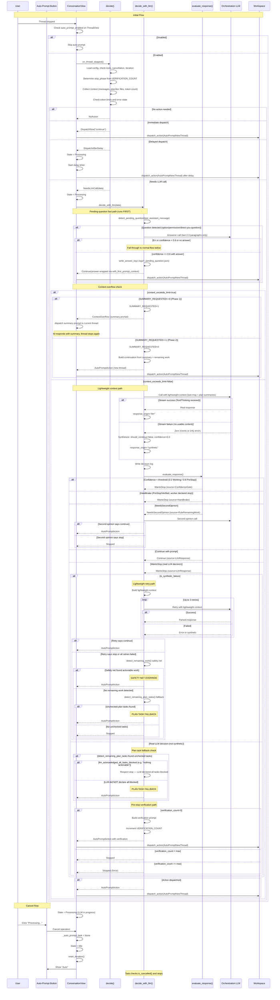

# Auto Prompt

Intercepts AI agent stop events, calls a configured LLM via Zed's built-in language model infrastructure, and decides whether a follow-up prompt should be dispatched automatically.

Toggled from the agent panel message editor toolbar — the sparkle icon next to "Follow the Zed Agent". Disabled by default; click to enable per thread.

## Architecture

This crate contains decision logic only. The caller (`agent_ui`) handles actual GPUI action dispatch.

```
ConversationView::handle_thread_event()
  └─ auto_prompt_enabled? No → skip
  │
  ├─ on_thread_stopped() — bridge in agent_ui
  │   └─ decide() — sync pre-check
  │       ├─ Config loaded? No → NoAction
  │       ├─ Used tools? No → NoAction
  │       ├─ Cancelled? Yes → NoAction
  │       ├─ Iteration > max? → NoAction
  │       ├─ Language model configured? No → NoAction
  │       ├─ Determine stop_phase (Working/PreStop) from VERIFICATION_COUNT
  │       ├─ Collect context (messages, plan/doc files, token count)
  │       ├─ Token overflow (max_context_tokens)? → DispatchNow("continue")
  │       ├─ StopReason::MaxTokens? → DispatchNow("continue")
  │       ├─ Error state or Refusal? → DispatchAfterDelay("continue")
  │       └─ Otherwise → NeedsLlmCall(data)
  │
  └─ decide_with_llm() — async LLM call
      ├─ detect_pending_question(last_assistant_message)? Yes → fast path:
      │   ├─ Build targeted prompt with last 2-3 paragraphs
      │   ├─ call_language_model with answerer system prompt
      │   ├─ Err → log, fall through to normal flow
      │   ├─ confidence < 0.6 or no answer → fall through to normal flow
      │   └─ confidence >= 0.6 + answer → Continue(answer)
      │
      ├─ context_exceeds_limit? Yes → ContextOverflow two-phase path:
      │   ├─ SUMMARY_REQUESTED==0 (Phase 1): send summary prompt to current thread
      │   ├─ SUMMARY_REQUESTED==1 (Phase 2): create new thread with summary + continuation
      │   └─ Unexpected state → reset and stop
      │
      ├─ context_exceeds_limit? No → Lightweight context path:
      │   ├─ Build lightweight context (last msg + plan summaries)
      │   └─ Call orchestration LLM with lightweight context
      │
      ├─ On stream failure (no Text/Thinking content):
      │   └─ Synthesize: should_continue=false, confidence=0.0, reason="model returned zero events..."
      ├─ Write decision log with response_origin ("llm" or "synthetic")
      │
      ├─ evaluate_response() — pure function, no side effects:
      │   ├─ Confidence < threshold (0.2 Working / 0.8 PreStop)? → WantsStop (source: ConfidenceGate)
      │   ├─ Handbrake (PreStop/Verified, worker declared stop)? → WantsStop (source: Handbrake)
      │   ├─ all_plan_done? → Continue with next plan or cleanup (source: LlmResponse)
      │   ├─ Confidence >= threshold + has prompt? → Continue (source: LlmResponse)
      │   ├─ Confidence >= threshold + no prompt? → WantsStop (source: LlmNoPrompt)
      │   ├─ Confidence < threshold + detect_remaining_work match? → NeedsSecondOpinion (source: RuleRemainingWork)
      │   └─ Confidence < threshold, no remaining work? → WantsStop (source: LlmResponse)
      │
      ├─ Match evaluation result:
      │   ├─ Continue → dispatch next thread
      │   ├─ NeedsSecondOpinion → call LLM again with extracted section
      │   │   ├─ Second opinion says continue → dispatch
      │   │   └─ Second opinion says stop → stop
      │   └─ WantsStop:
      │       ├─ is_synthetic_failure=true:
      │       │   ├─ Build lightweight context (last message + plan landscape)
      │       │   ├─ Retry up to 3x with exponential backoff
      │       │   ├─ Retry says continue → dispatch
      │       │   ├─ Retry says stop → detect_remaining_work safety net:
      │       │   │   ├─ Found actionable work → SAFETY NET OVERRIDE → dispatch
      │       │   │   ├─ No remaining work → detect_remaining_plan_tasks:
      │       │   │   │   ├─ Unchecked tasks found → PLAN TASK FALLBACK → dispatch
      │       │   │   │   └─ No unchecked tasks → accept stop
      │       │   │   └─ No remaining work → accept stop
      │       │   └─ All retries failed → detect_remaining_work safety net:
      │       │       ├─ Found actionable work → SAFETY NET OVERRIDE → dispatch
      │       │       ├─ No remaining work → detect_remaining_plan_tasks:
      │       │       │   ├─ Unchecked tasks found → PLAN TASK FALLBACK → dispatch
      │       │       │   └─ No unchecked tasks → accept stop
      │       │       └─ No remaining work → accept stop
      │       └─ is_synthetic_failure=false (real LLM decision):
      │           ├─ detect_remaining_plan_tasks?
      │           │   ├─ Unchecked tasks + LLM did NOT declare ALL tasks blocked → PLAN TASK FALLBACK → dispatch
      │           │   └─ LLM declared ALL tasks blocked (e.g. "nothing actionable") → respect stop
      │           ├─ verification_count=0 → pre-stop verification prompt
      │           ├─ verification_count < max → accept stop
      │           └─ verification_count >= max → force stop
      │
      └─ On error:
          ├─ Auto-retry with exponential backoff (up to max_llm_retries)
          ├─ If retries exhausted:
          │   ├─ Writes error log to .logs/
          │   ├─ Stores LlmCallData for manual retry
          │   └─ Returns error (state → Failed, button shows "Retry")
          └─ Returns error
```


```mermaid
sequenceDiagram
    participant User
    participant Button as Auto-Prompt Button
    participant CV as ConversationView
    participant decide as decide()
    participant decide_llm as decide_with_llm()
    participant eval as evaluate_response()
    participant LLM as Orchestration LLM
    participant Workspace as Workspace

    Note over User,Workspace: Initial Flow
    User->>CV: Thread stopped
    CV->>CV: Check auto_prompt_enabled on ThreadView
    alt Disabled
        CV->>CV: Skip auto-prompt
    else Enabled
        CV->>decide: on_thread_stopped()
        decide->>decide: Load config, check tools, cancellation, iteration
        decide->>decide: Determine stop_phase from VERIFICATION_COUNT
        decide->>decide: Collect context (messages, plan/doc files, token count)
        decide->>decide: Check token limits and error state
        
        alt No action needed
            decide-->>CV: NoAction
        else Immediate dispatch
            decide-->>CV: DispatchNow("continue")
            CV->>Workspace: dispatch_action(AutoPromptNewThread)
        else Delayed dispatch
            decide-->>CV: DispatchAfterDelay
            CV->>CV: State = Processing
            CV->>CV: Start delay timer
            CV->>Workspace: dispatch_action(AutoPromptNewThread) after delay
        else Needs LLM call
            decide-->>CV: NeedsLlmCall(data)
            CV->>CV: State = Processing
            CV->>decide_llm: decide_with_llm(data)

            Note over CV,decide_llm: Pending-question fast path (runs FIRST)
            decide_llm->>decide_llm: detect_pending_question(last_assistant_message)
            alt Question detected (option/permission/direct-you-question)
                decide_llm->>LLM: Answerer call (last 2-3 paragraphs only)
                alt Err or confidence < 0.6 or no answer
                    Note over decide_llm: Fall through to normal flow below
                else confidence >= 0.6 with answer
                    decide_llm->>decide_llm: write_answer_log (.logs/*_pending_question.json)
                    decide_llm-->>CV: Continue(answer wrapped via with_first_prompt_context)
                    CV->>Workspace: dispatch_action(AutoPromptNewThread)
                end
            end

            Note over CV,decide_llm: Context overflow check
            alt context_exceeds_limit=true
                alt SUMMARY_REQUESTED==0 (Phase 1)
                    decide_llm->>decide_llm: SUMMARY_REQUESTED=1
                    decide_llm-->>CV: ContextOverflow (summary prompt)
                    CV->>CV: dispatch summary prompt to current thread
                    Note over CV: AI responds with summary, thread stops again
                else SUMMARY_REQUESTED==1 (Phase 2)
                    decide_llm->>decide_llm: SUMMARY_REQUESTED=0
                    decide_llm->>decide_llm: Build continuation from summary + remaining work
                    decide_llm-->>CV: AutoPromptAction (new thread)
                    CV->>Workspace: dispatch_action(AutoPromptNewThread)
                end
            else context_exceeds_limit=false
                Note over CV,decide_llm: Lightweight context path
                decide_llm->>LLM: Call with lightweight context (last msg + plan summaries)
                
                alt Stream success (Text/Thinking received)
                    LLM-->>decide_llm: Real response
                    decide_llm->>decide_llm: response_origin="llm"
                else Stream failure (no usable content)
                    LLM-->>decide_llm: Zero events or only errors
                    decide_llm->>decide_llm: Synthesize: should_continue=false, confidence=0.0
                    decide_llm->>decide_llm: response_origin="synthetic"
                end
                
                decide_llm->>decide_llm: Write decision log
                decide_llm->>eval: evaluate_response()
                
                alt Confidence < threshold (0.2 Working / 0.8 PreStop)
                    eval-->>decide_llm: WantsStop (source=ConfidenceGate)
                else Handbrake (PreStop/Verified, worker declared stop)
                    eval-->>decide_llm: WantsStop (source=Handbrake)
                else NeedsSecondOpinion
                    eval-->>decide_llm: NeedsSecondOpinion (source=RuleRemainingWork)
                    decide_llm->>LLM: Second opinion call
                    alt Second opinion says continue
                        decide_llm-->>CV: AutoPromptAction
                    else Second opinion says stop
                        decide_llm-->>CV: Stopped
                    end
                else Continue with prompt
                    eval-->>decide_llm: Continue (source=LlmResponse)
                else WantsStop (real LLM decision)
                    eval-->>decide_llm: WantsStop (source=LlmResponse)
                    
                    alt is_synthetic_failure
                        Note over decide_llm: Lightweight retry path
                        decide_llm->>decide_llm: Build lightweight context
                        loop Up to 3 retries
                            decide_llm->>LLM: Retry with lightweight context
                            alt Success
                                LLM-->>decide_llm: Parsed response
                            else Failed
                                LLM-->>decide_llm: Error or synthetic
                            end
                        end
                        
                        alt Retry says continue
                            decide_llm-->>CV: AutoPromptAction
                        else Retry says stop or all retries failed
                            decide_llm->>decide_llm: detect_remaining_work() safety net
                            alt Safety net found actionable work
                                Note over decide_llm: SAFETY NET OVERRIDE
                                decide_llm-->>CV: AutoPromptAction
                            else No remaining work detected
                                decide_llm->>decide_llm: detect_remaining_plan_tasks() fallback
                                alt Unchecked plan tasks found
                                    Note over decide_llm: PLAN TASK FALLBACK
                                    decide_llm-->>CV: AutoPromptAction
                                else No unchecked tasks
                                    decide_llm-->>CV: Stopped
                                end
                            end
                        end
                        
                    else Real LLM decision (not synthetic)
                        Note over decide_llm: Plan task fallback check
                        alt detect_remaining_plan_tasks found unchecked tasks
                            alt llm_acknowledged_all_tasks_blocked (e.g. "nothing actionable")
                                decide_llm->>decide_llm: Respect stop — LLM declared all tasks blocked
                            else LLM did NOT declare all blocked
                                Note over decide_llm: PLAN TASK FALLBACK
                                decide_llm-->>CV: AutoPromptAction
                            end
                        end
                        
                        Note over decide_llm: Pre-stop verification path
                        alt verification_count=0
                            decide_llm->>decide_llm: Build verification prompt
                            decide_llm->>decide_llm: Increment VERIFICATION_COUNT
                            decide_llm-->>CV: AutoPromptAction with verification
                            CV->>Workspace: dispatch_action(AutoPromptNewThread)
                        else verification_count < max
                            decide_llm-->>CV: Stopped
                        else verification_count >= max
                            decide_llm-->>CV: Stopped (force)
                        end
                    end
                end
                
                alt Action dispatched
                    decide_llm-->>CV: AutoPromptAction
                    CV->>Workspace: dispatch_action(AutoPromptNewThread)
                end
            end
        end
    end
    
    Note over User,Button: Cancel Flow
    CV->>CV: State = Processing (LLM in progress)
    User->>Button: Click "Processing..."
    Button->>CV: Cancel operation
    CV->>CV: _auto_prompt_task = None
    CV->>CV: State = Idle
    CV->>CV: reset_iteration()
    CV->>Button: Show "Auto"
    Note over decide_llm: Task checks is_cancelled() and stops
```

### Chain timeout

If more than 300 seconds (`CHAIN_TIMEOUT_SECS`) pass between iterations, the chain is considered stale and the iteration counter resets on the next call. This prevents stale chains from accumulating.

### Stuck-thread watchdog

**Problem**: All other timeouts in auto_prompt run *after* `on_thread_stopped` fires. If the worker LLM stream hangs (provider stall, rate-limit with empty body, ACP protocol dead-end), the thread stays in `Generating` forever and `on_thread_stopped` never fires. None of the existing timeouts can recover from this.

**Solution**: A watchdog task (`auto_prompt/src/watchdog.rs`) is armed when auto_prompt dispatches a continuation. It sleeps for `watchdog_timeout_secs` (default 600 = 10 minutes), then:

1. Checks if the thread is still `Generating`. If not, the thread recovered — exit.
2. Gathers context: last tool call (input + output), last assistant message, cumulative elapsed time, timeout number.
3. Calls a headless reasoning LLM with a dedicated system prompt that classifies the stuck state.
4. The LLM returns `{ "action": "continue" | "halt", "reason": "..." }`.
5. **`continue`**: Reschedule the watchdog for another window. The reasoning LLM sees the incremented timeout number next time (1st → 2nd → 3rd...).
6. **`halt`**: Cancel the worker thread (`thread.cancel()`), wait for cancel completion, then dispatch a timeout-recovery prompt to the same thread: "Your last tool call completed N minutes ago but you produced no follow-up. Decide: retry, try another approach, or stop." The worker restarts generation with this context.

**Key safety properties**:
- On any reasoning LLM failure (unreachable, unparseable, timeout), defaults to `Continue` — never kills a possibly-fine worker on a flaky reasoning call.
- The reasoning LLM can distinguish "`git log` returned 3 lines 10 min ago" (halt) from "`cargo test` still running" (continue).
- Config: `watchdog_timeout_secs` (env: `ZED_AUTO_PROMPT_WATCHDOG_TIMEOUT_SECS`), `watchdog_enabled` (env: `ZED_AUTO_PROMPT_WATCHDOG_ENABLED`). Disable with `watchdog_enabled: false`.
- Decisions logged to `/tmp/zed_auto_prompt/{ms}_{seq}_watchdog_decision.json`.

**Lifecycle**: The watchdog task is stored in `ThreadView._watchdog_task`. It is cancelled (dropped) whenever the thread stops normally (`Stopped` / `Error` events). A new watchdog is armed each time auto_prompt dispatches a continuation.

### Thread summary context grounding

Every auto-prompt dispatch prepends a comprehensive thread summary via `with_first_prompt_context()`. The orchestration LLM generates this summary with the active plan bolded, keeping long auto-prompt chains grounded in the full conversation context. The `build_prompt_summary()` function selects the best source in priority order:

1. `thread_summary` returned by the orchestration LLM (preferred)
2. Synthesized from `title` + `reason` + `last_assistant_message` (up to 2000 chars)
3. `original_user_message` carried from thread 0 (fallback)
4. `first_user_message` extracted via `extract_original_user_message` (last resort)

The `last_assistant_message` field collects **all** consecutive assistant chunks from the end of the thread (not just the last single chunk), ensuring multi-part responses are fully captured in the summary.

### Debug logs

Every LLM decision is logged to `.logs/` in the project root as JSON files:

```
.logs/
├── 2025-01-15T14-30-22.123_1.json       # iteration 1 decision
├── 2025-01-15T14-31-05.456_2.json       # iteration 2 decision
└── 2025-01-15T14-31-10.789_2_error.json # iteration 2 error
```

Each log file contains:

| Field | Description |
|-------|-------------|
| `timestamp` | ISO 8601 timestamp |
| `iteration` | Auto-prompt cycle number |
| `model` | LLM model identifier |
| `response_origin` | **`"llm"`** (real model response) or **`"synthetic"`** (code-generated fallback when model stream failed) |
| `request.system_prompt` | The system prompt sent to the LLM |
| `request.context_json` | The full context JSON (messages, plan files, doc files) |
| `raw_response` | Raw text returned by the LLM, or synthetic JSON when stream failed |
| `parsed_response` | Parsed `should_continue`, `next_prompt`, `reason`, `all_plan_done`, `confidence` |
| `error` | Error message (error logs only) |

**How to read `response_origin`**: When `"synthetic"`, the `parsed_response` was NOT generated by the LLM — it was fabricated by the code because the model stream produced no usable content. The `confidence` will be `0.0` and the `reason` will start with `"model"`. The decision then enters the synthetic failure path (lightweight retry + safety net).

Add `.logs/` to `.gitignore` — these are for local debugging only.

### Core loop

The orchestration LLM follows a simple priority order:

1. **Pending question fast path** (`detect_pending_question`) — see dedicated section below
2. **Pre-stop verification** (`stop_phase=pre_stop`) → verify plans/diagnostics/git, continue if any fail
3. **Plan steps remain** → continue next unchecked `[ ]` step
4. **New plan without checkboxes** → refine plan to add checkboxes
5. **AI asked a question** (normal-path fallback) → auto-answer (pick option 1 or AI recommendation)
6. **All steps `[x]`** → fix diagnostics/tests, then create docs, then done
7. **No plan but work incomplete** → "continue"
8. **Confidence < 0.5** → stop
9. **iteration_count > 15** → consider stopping

### Pending question fast path

When the worker agent ends its turn by asking the user a direct question
("Which do you want? Option A or Option B?", "Want me to do that?"), the
normal orchestration flow wastes a cycle: it cannot "continue work" because
there is none — there is a question — so it returns `should_continue=false`
and drifts into pre-stop verification or the ContextOverflow summary dance.
That summary drains tokens and throws away the agent's actual question.

The fast path in `pending_question.rs` runs **before** the overflow /
lightweight / verification paths in `decide_with_llm`. It:

1. **Detects** the question via `detect_pending_question` — scans the last 3
   paragraphs for option-request patterns ("option a/b", "which do you want",
   "a or b"), permission-request patterns ("want me to", "should i",
   "would you like"), or a paragraph ending in `?` that addresses the user in
   the second person.
2. **Skips** auto_prompt's own summary responses (same guard as
   `detect_remaining_work`) to avoid re-looping the overflow dance.
3. **Calls the LLM** with a dedicated answerer system prompt and only the
   last 2-3 paragraphs as context — cheap regardless of overall context size.
4. **Dispatches** the answer as `Continue` (wrapped via
   `with_first_prompt_context`) when the answerer's confidence >= 0.6.
5. **Falls through** to the normal flow on any failure: no question detected,
   LLM call error, unparseable response, or confidence < 0.6. This is the
   user's explicit requirement: uncertain cases still reach stop/summary.

The fast path is **purely additive** — every branch either returns a
`Continue` with a real answer or falls through. No existing behavior is
removed. Decisions are logged to `.logs/{timestamp}_{iteration}_pending_question.json`
for debuggability.

### Decision provenance (DecisionSource)

Every evaluation result carries a `DecisionSource` that answers "who decided this?":

| Source | Meaning |
|--------|----------|
| `LlmResponse` | LLM produced a real response with confidence ≥ threshold — its decision used directly |
| `ConfidenceGate` | Code overrode because confidence < threshold (phase-dependent: 0.2 Working, 0.8 PreStop) |
| `Handbrake` | Worker AI explicitly declared stopping after verification ("stopping, nothing related") |
| `RuleRemainingWork` | `detect_remaining_work` found patterns ("Next Steps", "remaining work", unchecked checkboxes) → second opinion requested |
| `LlmNoPrompt` | LLM said continue but provided no usable prompt |
| `PlanTaskFallback` | `detect_remaining_plan_tasks` found unchecked plan tasks — overrides stop to continue them |

Logged as `evaluate_response: source=ConfidenceGate, result=WantsStop { ... }` in `RUST_LOG=info` output.

### Synthetic failure path

When the orchestration LLM stream produces no usable content (zero Text/Thinking events), `call_language_model` synthesizes a fallback response:

```json
{"should_continue": false, "confidence": 0.0, "reason": "model returned zero events (N total stream events)"}
```

This triggers the synthetic failure path in `decide_with_llm`:

1. `evaluate_response` hits the confidence gate (`0.0 < 0.2` → `WantsStop`, source=`ConfidenceGate`)
2. `is_synthetic_failure=true` is detected (confidence ≤ 0.3 + reason starts with "model")
3. **Lightweight retry**: builds a smaller context (last 3 paragraphs of assistant message + plan landscape) and retries up to 3 times with exponential backoff (2s, 4s, 8s)
4. If any retry succeeds and says continue → dispatch
5. If retry says stop or all retries fail → **safety net** (see below)

### Safety net (detect_remaining_work)

Before accepting any stop from the synthetic failure path, `detect_remaining_work` runs against `last_assistant_message` as a final safety net:

1. Scans for trigger patterns: `"remaining work"`, `"next step"`, `"next steps"`, `"todo:"`, `"action items"`, `"left to do"`, `"still need"`, unchecked `- [ ]` checkboxes
2. Validates that extracted section has actionable content (`- `, `* `, `1.`, `TODO`, `must`, `need to`)
3. If actionable work found → **SAFETY NET OVERRIDE**: forces continuation with the extracted section as the prompt
4. If no remaining work found → check `detect_remaining_plan_tasks` (see below)

This prevents the chain from stopping when the model is temporarily broken but the last assistant message clearly describes unfinished work (e.g. "### Next Steps" listing T2.4, T2.5, T2.6).

The safety net runs in two places:
- **Retry says stop** (synthetic failure path): LLM returned a real response but decided to stop
- **All retries failed** (synthetic failure path): Model completely unreachable, all 3 attempts produced no usable content

### Plan task fallback (detect_remaining_plan_tasks)

When the safety net finds no remaining work in the last assistant message, `detect_remaining_plan_tasks` checks plan file contents for unchecked `[ ]` tasks. It:

1. Parses `context_json` for plan file paths and contents
2. Skips plans claimed by other sessions (multi-agent coordination)
3. Skips non-actionable items: strikethrough (`~~`), "Skipped", "Cancelled", "Deferred", "Out of Scope" sections
4. If actionable unchecked tasks found → **PLAN TASK FALLBACK**: continues with "Plan files have remaining unchecked tasks: ..."
5. If no actionable tasks → accepts stop

**All-tasks-blocked check**: When `is_synthetic_failure=false` (real LLM decision), the fallback checks `llm_acknowledged_all_tasks_blocked()` before overriding. Only when the LLM explicitly declares that ALL remaining work is blocked (e.g., "nothing actionable", "all remaining tasks are blocked", "no further action") does the system respect the stop. This is intentionally strict — a message mentioning "remaining" and "blocked" somewhere does NOT qualify, since that could describe a summary with some blocked tasks and other actionable ones.

### Pre-stop verification

When the LLM indicates work is complete (`should_continue=false` with no prompt) and the response is NOT synthetic, the system enters a pre-stop verification phase:

1. First attempt (`verification_count=0`): Build verification prompt to check:
   - All plan checkboxes are `[x]` (no `[ ]` remaining)
   - All compiler diagnostics and warnings fixed
   - Git committed with conventional commit messages
   - Same-repo plans with unchecked tasks should be continued, not stopped
2. Increment `VERIFICATION_COUNT`
3. If verification fails or LLM continues: Reset `VERIFICATION_COUNT` to 0 (new cycle)
4. Subsequent attempts (`verification_count < max_verification_attempts`): Accept the stop
5. Max attempts exceeded: Force stop

The verification prompt lists remaining plans with unchecked tasks and instructs the worker to continue same-repo plans rather than stopping. The "stopping" declare option is qualified with "only when NO same-repo plans have unchecked tasks."

If no plan files exist, verification is skipped and the chain stops immediately.

**Not triggered for synthetic failures** — pre-stop verification only runs when the LLM produced a real decision. Synthetic failures go through the lightweight retry + safety net path instead.

**Not triggered when worker is waiting for user decision** — if `is_waiting_for_user_decision(last_assistant_message)` detects an explicit deferral to the user (e.g. "I won't pick for you", "you decide", "need your input", "let me know which", "awaiting your decision"), the chain stops immediately without verification. Another nudge would just reproduce the same question. This is distinct from rule 3 permission-seeking ("Want me to proceed?") which is auto-answered — the worker explicitly declines to make the choice itself. Triggers are deliberately specific phrases; a bare "which approach?" without an explicit deferral does NOT trigger this path (rule 3 handles it).

### Context overflow

When token count exceeds `max_context_tokens` (default 80K), the system uses a two-phase mechanism tracked by the per-session summary registry:

1. **Phase 1** (`summary_state == 0`): Send a summarization prompt to the **current thread** asking the AI to summarize progress, accomplishments, remaining work, and active plan state. Set `summary_state = 1`.
2. The AI responds with a summary. The thread stops, triggering `on_thread_stopped` again.
3. **Phase 2** (`summary_state == 1`): The AI's summary is now `last_assistant_message`. Create a **new thread** with the summary + continuation prompt. Reset `summary_state = 0`.

**Phase 2 continuation priority** (most-recently-fixed):

1. **Summary's own next-steps section** (`extract_summary_next_steps`) — scans the summary for a `## Recommended Next Steps` / `## What Remains` / `## Next Steps` heading (or prose trigger in the last 3 paragraphs) and uses it verbatim. This is the authoritative source: the worker AI just wrote these steps knowing the full context.
2. **Current-repo unclaimed plans** (`detect_remaining_plan_tasks(CurrentRepo)`) — unchecked `[ ]` tasks in plan files under the session's own `work_dirs`. Uses `plan_belongs_to_current_repo` to classify.
3. **Other-repo unclaimed plans** (`detect_remaining_plan_tasks(OtherRepos)`) — last-resort cross-repo fallback.
4. **Generic** — `"Continue from where we left off."`

The `llm_acknowledged_all_tasks_blocked` short-circuit (all-blocked declaration → generic continuation) still takes priority over everything above.

`detect_remaining_work` is intentionally NOT consulted in Phase 2: it skips auto_prompt summary responses (see its guard) to avoid re-summarization loops in the safety-net path. Phase 2 uses `extract_summary_next_steps` instead, which is purpose-built for summary messages.

**Phase tracking survives `reset_iteration()`** — the summary registry is per-session and NOT included in the general counter reset. It is only cleared by:
- Phase 2 completion (new thread created)
- Thread cancellation
- Max iterations reached
- Chain timeout (300s)
- Unexpected state

This prevents re-requesting summaries when the AI has already responded with one.

**Overflow logging**: Every overflow-phase decision is written to `.logs/{timestamp}_{iteration}_overflow.json` via `write_overflow_log`, recording `phase`, `summary_state`, `continuation_source` (one of `phase1_request_summary`, `summary_next_steps`, `plan_tasks_current_repo`, `plan_tasks_other_repos`, `all_blocked_generic`, `slash_command_preserved`, `generic_fallback`, `unexpected_state`), the resulting `next_prompt`, and a truncated preview of `last_assistant_message`. Without this, the overflow path was invisible — all three branches `return` early before `write_decision_log` at the bottom of `decide_with_llm`, so only the pre-call `write_stop_log` ("evaluation started") marker survived.

### Handbrake (loop prevention)

When the worker AI explicitly declares stopping with phrases like `stopping, nothing related` or `stopping, no further action`, the `evaluate_response` function forces a `WantsStop` result regardless of what the orchestration LLM decided. This breaks loops where the orchestration LLM keeps seeing unchecked plan items and continuing despite the worker's explicit stop declaration.

**Scoped to post-verification only** — the handbrake only triggers when `stop_phase` is `PreStop` or `Verified`, not during the normal `Working` phase. This prevents false positives where a worker AI mentioning "stopping" during normal work would accidentally terminate the chain.

The handbrake matches `last_assistant_message` containing "stopping" combined with one of: "nothing related", "no further action", "nothing left", "no further work". The word "stopping" alone does **not** trigger the handbrake — it requires a qualifying phrase.

The handbrake fires **before** `detect_remaining_work` and `detect_remaining_plan_tasks`, so it takes priority over both safety nets.

### Quality gates

Before marking `all_plan_done=true`, the system enforces:

- Production grade: no mock, no TODO, no placeholder, no `unwrap()`
- Fix all compiler diagnostics and warnings
- Ensure test coverage for new code

### Remaining work detection

The `detect_remaining_work` function extracts potential remaining work from the last assistant message. It scans for trigger phrases ("next steps", "remaining work", "todo:", etc.) and unchecked checkboxes, then validates that the extracted section contains actionable items. Used in two contexts:

1. **evaluate_response (normal path)**: When LLM says stop with confidence below threshold, `detect_remaining_work` triggers `NeedsSecondOpinion` — a second LLM call decides whether the remaining work is real or a false positive.
2. **Safety net (synthetic failure path)**: When lightweight retries fail or say stop, `detect_remaining_work` runs as a final check before accepting stop — no second opinion, direct override.

The `extract_remaining_section` helper scans the last 3 paragraphs of the message for trigger words or actionable checkboxes, including the preceding paragraph if it looks like a header.

### All-tasks-blocked check (llm_acknowledged_all_tasks_blocked)

When `detect_remaining_plan_tasks` finds unchecked plan tasks in the real LLM decision path, `llm_acknowledged_all_tasks_blocked` checks whether the LLM's last message explicitly declares that ALL remaining work is blocked. This replaced the older `llm_acknowledged_blocked_tasks` which was too broad — it matched any message containing "remaining" + any blocking keyword ("blocked", "hardware", "external", etc.), which frequently caused false stops on summary messages.

The function only returns `true` for explicit all-blocked declarations:

- "nothing actionable"
- "nothing left to do" / "nothing left to implement"
- "all remaining" + "blocked"
- "no further action" / "no further work"
- "cannot proceed further" / "can't proceed further"

Messages like "5 remaining tasks require GPU hardware" or "Remaining Work (blocked or needs real .mlmodelc)" do **not** qualify — they describe some blocked tasks among potentially actionable ones, and the system should still check for non-blocked work.

### Key types

- `AutoPromptDecision` — sync result: `NoAction`, `DispatchNow(AutoPromptAction)`, `DispatchAfterDelay { action, delay_ms }`, `NeedsLlmCall(LlmCallData)`
- `AutoPromptOutcome` — async result from LLM: `Continue(AutoPromptAction)`, `Stopped { reason }`, `ContextOverflow(AutoPromptAction)`
- `AutoPromptAction` — data needed to dispatch a follow-up prompt (`from_session_id`, `from_title`, `next_prompt`, `work_dirs`)
- `LlmCallData` — data for async LLM call (`model`, `system_prompt`, `context_json`, `project_root`, `session_id`, `title`, `iteration_count`, `max_verification_attempts`, `work_dirs`, `first_user_message`, `last_assistant_message`, `stop_phase`); stored on failure for manual retry
- `AutoPromptContext` — serializable context payload sent to the orchestration LLM (includes `plan_files`, `doc_files` (filenames only), `modified_files`, `first_user_message`, `stop_phase`, `verification_count`, `plan_has_checkboxes`, `first_plan_filename`, `plan_number`, `was_truncated`)
- `EvaluationInput` — input to the pure `evaluate_response()` function (`should_continue`, `confidence`, `next_prompt`, `reason`, `all_plan_done`, `next_plan_prompt`, `last_assistant_message`, `is_synthetic_failure`, `stop_phase`)
- `EvaluationResult` — output of `evaluate_response()`: `Continue { prompt, reason }`, `WantsStop { reason }`, `NeedsSecondOpinion { extracted_section, rule_reason }`; carries `DecisionSource` via `.source()` method
- `DecisionSource` — provenance enum: `LlmResponse`, `ConfidenceGate`, `Handbrake`, `RuleRemainingWork`, `LlmNoPrompt`, `PlanTaskFallback`
- `AutoPromptResponse` — expected JSON response from the LLM (`should_continue`, `next_prompt`, `reason`, `all_plan_done`, `confidence`, `thread_summary`)
- `StopPhase` — lifecycle phase: `Working` (normal), `PreStop` (verification), `Verified` (terminal)
- `AutoPromptConfig` — loaded from `~/.config/zed/auto_prompt.json` or env vars (cached with file-watcher invalidation)

### Files

| File | Purpose |
|------|----------|
| `src/auto_prompt.rs` | `decide()` (sync), `decide_with_llm()` (async), `evaluate_response()`, `detect_remaining_work()`, `detect_remaining_plan_tasks()`, `llm_acknowledged_all_tasks_blocked()`, system prompt, iteration tracking, plan/doc reading, LLM client, verification prompts, config caching |
| `src/config.rs` | `AutoPromptConfig` from `~/.config/zed/auto_prompt.json` or env vars |
| `src/context.rs` | `AutoPromptContext`, `AutoPromptResponse`, `StopPhase`, plan/message serialization |
| `src/lightweight_context.rs` | `build_lightweight_orchestration_context()` — compact context (last message + plan summaries) to reduce token usage from ~80K to ~500 |
| `src/pending_question.rs` | `detect_pending_question()`, `try_answer_pending_question()` — fast path that answers the worker agent's direct questions to the user (option choices, permission requests) instead of stopping. Falls through to the normal flow on low confidence or failure |
| `src/plan_registry.rs` | Plan claim tracking for multi-agent coordination — `try_claim()`, `release()`, `heartbeat()`, `auto_claim_from_prompt()` |

### Bridge in agent_ui

`crates/agent_ui/src/auto_prompt/mod.rs` — thin bridge that:

- Defines `ToggleAutoPrompt` GPUI action (toolbar toggle button: Auto/Off/Processing.../Retry)
- Defines `AutoPromptNewThread` GPUI action (creates follow-up thread with `from_session_id`, `from_title`, `next_prompt`, `work_dirs`)
- Defines `AutoPromptState` enum: `Idle`, `Processing`, `Failed`
- `on_thread_stopped()` delegates to `auto_prompt::decide()`, handles async LLM path with retry loop
- `dispatch_action()` routes to same-thread continuation (native/compact) or new thread:
  - **Same-thread**: decision-only prompt (no last assistant message repeat — it's already visible in thread history)
  - **New thread**: full 3-part format via `auto_prompt_new_thread()` with summary + last assistant message + decision
- `extract_decision_prompt()` extracts `## 3. Decision` section from `next_prompt` for the `AutoPromptNewThread.decision_prompt` field

**Two entry points** call into the bridge:

1. **Automatic flow** (`conversation_view.rs` `AcpThreadEvent::Stopped` handler):
   Only fires when `auto_prompt_enabled` is `true` on the active `ThreadView`.
   Calls `on_thread_stopped()` → full LLM decision pipeline.

2. **Manual sparkle button** (`thread_view.rs` `manual_auto_prompt()`):
   Always available in thread controls (bottom-right sparkle icon).
   Bypasses the LLM decision pipeline — directly calls `dispatch_action()` with
   `actual_input_tokens` from `thread.token_usage()`. This ensures the token
   threshold check works correctly (no async LLM call that might lose the real
   token count). Also enables `auto_prompt_enabled` so subsequent automatic
   cycles can complete (e.g., ContextOverflow Phase 2).

   The manual sparkle button is for "kick the AI to keep working now" — it sends
   a simple continuation prompt and lets `dispatch_action` decide same-thread
   vs new-thread based on the token threshold.

### New thread content (auto_prompt_new_thread)

When `AutoPromptNewThread` is dispatched, `AgentPanel::auto_prompt_new_thread()` (in `agent_panel.rs`) builds a 3-section `ContentBlock` prompt:

```
## 1. Summary
[crease mention — expandable, full last_assistant_message]

## 2. Last Assistant Message
{truncate_to_paragraph_budget(last_assistant_message, 4000)}

---

## 3. Decision
{build_continuation_prompt(last_assistant_message)}
```

**Functions involved:**

| Function | Location | Purpose |
|----------|----------|---------|
| `auto_prompt_new_thread()` | `agent_ui/agent_panel.rs` | Builds 3-section ContentBlock, creates external thread with auto_submit |
| `build_continuation_prompt()` | `agent_ui/src/auto_prompt/mod.rs` | Formats same-thread continuation: emits the decision as-is, falls back to minimal `"Continue from where we left off."` only when the decision is empty/generic |
| `detect_remaining_work()` | `auto_prompt/auto_prompt.rs` | Scans last_assistant_message for "remaining work", "todo:", unchecked `- [ ]` |
| `truncate_to_paragraph_budget()` | `auto_prompt/context.rs` | Truncates text to N chars, splitting at paragraph boundaries |
| `extract_decision_prompt()` | `auto_prompt/auto_prompt.rs` | Extracts `## 3. Decision` section from `with_first_prompt_context` formatted text |

**Why no duplication:** The orchestration LLM's `next_prompt` (from `with_first_prompt_context`) is NOT included in the new thread. It already contains `## 1. Thread Summary` + `## 2. Last Assistant Message` + `## 3. Decision` which would duplicate the mention content. Instead, `build_continuation_prompt()` generates the decision independently from `last_assistant_message` only.

**Static fallback:** When `detect_remaining_work()` finds nothing, the decision section becomes: `"Make good decision based on above information or stop if no action needed."` — letting the worker LLM decide autonomously from the context.

### Same-thread continuation

When the token count is below the `same_thread_token_threshold` (default 60K), continuations are sent to the **same thread** instead of creating a new one:

- **Native Zed agent**: the orchestration LLM's decision is emitted **as-is** (no static preamble prepended)
- **ACP agents (Claude, etc.)**: a minimal orchestration LLM call reasons over the agent's last 2-3 paragraphs and returns `{continue, confidence, next_prompt, reason}`. The verdict drives continue-vs-stop; `next_prompt` (when continue) is sent as-is. See `claude_agent.rs`.

### Manual auto-prompt (sparkle button)

Clicking the sparkle button in a thread runs the **same** orchestration path as the automatic `Stopped` trigger — `agent_ui::auto_prompt::on_manual_auto_prompt()` calls `run_auto_prompt()` with `stop_reason = EndTurn` and a fallback action. So a manual click reasons about the agent's last paragraphs (and, on the hidden-orchestrator path, the plan files) exactly like an automatic continuation.

The difference from the automatic path is only what happens when the orchestrator declines:

| Orchestrator outcome | Automatic trigger | Manual click |
|---|---|---|
| `Continue` / `DispatchNow` | dispatch the decision | dispatch the decision (focused) |
| `NoAction` | send nothing | dispatch the generic `"Continue from where we left off."` fallback |
| `Stopped { reason }` | toast, send nothing | dispatch the generic fallback |
| Orchestration call failed | `Failed` state + retry affordance | dispatch the generic fallback |

A click is an explicit request to continue, so the thread must always receive something — but the static nudge is now the last resort, not the only behavior.

The last assistant message is **not** repeated — it's already visible in the thread history. Only the orchestration LLM's decision is sent, keeping the continuation concise and avoiding the two-voice failure mode where a generic "Continue from where we left off…" preamble would be bolted onto a substantive task instruction.

**`build_continuation_prompt(decision)` behavior** (`agent_ui/src/auto_prompt/mod.rs`):

| Decision content | Emitted message |
|------------------|-----------------|
| Substantive task (e.g. "Scaffold the issue file at…", "Implement X. Production grade only.") | The decision, unchanged |
| Bare generic "Continue from where we left off." (overflow fallback, orchestrator declined on a manual run) | `"Continue from where we left off."` (minimal fallback) |
| Empty | `"Continue from where we left off."` (minimal fallback) |

The fallback is intentionally minimal. Behavioral meta-instructions ("commit when done", "review remaining work") belong in the agent's system prompt or the user's `AGENTS.md`, not bolted onto every same-thread continuation — otherwise a reply like "Yes, I love you" to "Do you love me?" would get prefixed with "Continue from where we left off. Summarize prior context internally…", producing an absurd two-paragraph message.

**Routing rules** (hard invariant — enforced in `dispatch_action`):

| Agent type | Tokens < threshold | Tokens >= threshold | Active thread gone |
|------------|-------------------|--------------------|--------------------|
| Native Zed agent | Same thread (native prompt) | **New thread** | New thread (fallback) |
| ACP agents (Claude, etc.) | Same thread (orchestrator verdict) | Same thread (orchestrator verdict) | **Stop** (no new thread) |

ACP agents **never** create new threads — they rely on conversation history in the same thread. The Claude path has no static continuation prompt, no max-iterations gate, no pre-stop verification, and no context-overflow flow: every non-cancel decision goes through the orchestration LLM, which is the sole decider. If the active thread is gone when `dispatch_action` runs, the chain stops instead of falling back to a new thread.

### User Interface - Retry and Cancel

The auto-prompt toggle button in the agent panel toolbar (sparkle icon) displays four states, each with distinct behavior:

| Button State | Description | Click Behavior |
|--------------|-------------|-----------------|
| **"Auto"** | Auto-prompt is enabled and idle | Toggles to "Off" (disables auto-prompt) |
| **"Off"** | Auto-prompt is disabled (default) | Toggles to "Auto" (enables auto-prompt) |
| **"Processing..."** | Auto-prompt is currently making an LLM decision or dispatching a follow-up prompt | Cancels the current operation (button returns to "Auto") |
| **"Retry"** | LLM call failed after all automatic retry attempts | Manually retries the failed LLM call with the same data |

#### Retry Mechanism

When the orchestration LLM call fails after exhausting all automatic retries (`max_llm_retries`), the system:

1. **Stores retry data**: The `LlmCallData` (model, system prompt, context JSON, etc.) is saved in the ThreadView for potential manual retry
2. **Enters Failed state**: The button displays "Retry" with error color
3. **Enables manual retry**: Clicking "Retry" triggers:
   - LLM failure count reset for fresh retry attempt
   - State changes to "Processing..." (button shows "Processing...")
   - Async task spawned to call `decide_with_llm()` with the stored data
   - On success: State → `Idle`, retry data cleared, action dispatched
   - On failure: State → `Failed`, retry data restored (allows multiple manual retries)

#### Cancel Mechanism

When auto-prompt is processing (button shows "Processing..."), clicking the button:

1. **Cancels the task**: Drops the current `_auto_prompt_task`, which cancels any ongoing LLM call or pending action dispatch
2. **Resets state**: Sets `auto_prompt_state` to `Idle`
3. **Resets iteration**: Clears the iteration counter via `reset_iteration()`
4. **Stops processing**: The async task's `is_cancelled()` check prevents any further actions from being dispatched

The cancel mechanism is useful for interrupting long-running LLM decisions or stopping the auto-prompt loop when the user wants to take manual control.

## Configuration

Config file: `~/.config/zed/auto_prompt.json`

```json
{
  "max_iterations": 20,
  "max_context_tokens": 80000,
  "backoff_base_ms": 2000,
  "max_verification_attempts": 2,
  "max_llm_retries": 3,
  "same_thread_token_threshold": 60000,
  "watchdog_timeout_secs": 600,
  "watchdog_enabled": true
}
```

| Field | Default | Description |
|-------|---------|-------------|
| `system_prompt` | built-in | Override the orchestration LLM system prompt |
| `max_iterations` | `20` | Hard stop after this many auto-prompt cycles |
| `max_context_tokens` | `80000` | Token threshold to trigger context overflow two-phase (summary → new thread) |
| `backoff_base_ms` | `2000` | Base delay for exponential backoff on errors (capped at 60s) |
| `max_llm_retries` | `3` | Max automatic retry attempts for LLM calls before showing "Retry" button |
| `max_verification_attempts` | `2` | Max verification prompts in PreStop phase before accepting stop |
| `same_thread_token_threshold` | `60000` | Token count below which auto-prompt continues in the same thread instead of creating a new thread |
| `watchdog_timeout_secs` | `600` | Seconds the worker may stay in `Generating` before a reasoning LLM decides continue/halt |
| `watchdog_enabled` | `true` | Whether the stuck-thread watchdog is active |

Note: Enable/disable is controlled by the UI toggle (sparkle button) per thread, not by the config file.

Environment variable overrides: `ZED_AUTO_PROMPT_MAX_ITERATIONS`, `ZED_AUTO_PROMPT_MAX_CONTEXT_TOKENS`, `ZED_AUTO_PROMPT_BACKOFF_BASE_MS`, `ZED_AUTO_PROMPT_SYSTEM_PROMPT`, `ZED_AUTO_PROMPT_MAX_LLM_RETRIES`, `ZED_AUTO_PROMPT_MAX_VERIFICATION_ATTEMPTS`, `ZED_AUTO_PROMPT_SAME_THREAD_TOKEN_THRESHOLD`, `ZED_AUTO_PROMPT_WATCHDOG_TIMEOUT_SECS`, `ZED_AUTO_PROMPT_WATCHDOG_ENABLED`.

## E2E Testing

A full end-to-end test exercises the git flow with a helloworld Rust project.

### Setup

```bash
script/test-auto-prompt-e2e setup /tmp/hw-test
```

This creates a Cargo project at `/tmp/hw-test` with a `.plan/01_helloworld_flow.md` plan file, initialized on `main` with a `develop` branch.

### Test with Zed

1. Build Zed:
   ```bash
   cargo build -p zed
   ```

2. Open the test project:
   ```bash
   target/debug/zed /tmp/hw-test
   ```

3. Open Agent Panel (`cmd+i`), click the sparkle button to enable auto-prompt, and send:
   ```
   Read .plan/01_helloworld_flow.md and execute the plan starting from Step 2.
   ```

4. Watch the auto-prompt loop fire on each `Stopped` event, call the orchestration LLM, and dispatch follow-up prompts until all plan items are complete.

### Verify

```bash
script/test-auto-prompt-e2e verify /tmp/hw-test
```

Runs 12 checks: branches, tags, tests, conventional commits, version bumps, plan progress, function correctness.

### Other commands

```bash
script/test-auto-prompt-e2e status /tmp/hw-test      # show git state
script/test-auto-prompt-e2e inject-bug /tmp/hw-test   # inject bug for Step 7
script/test-auto-prompt-e2e teardown /tmp/hw-test     # cleanup