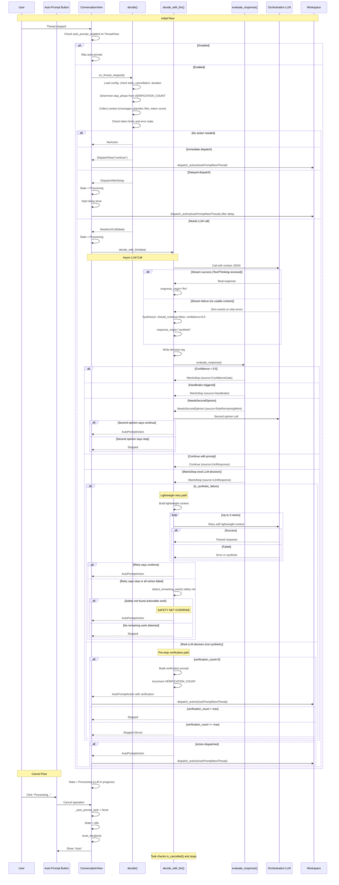

# Auto Prompt

Intercepts AI agent stop events, calls a configured LLM via Zed's built-in language model infrastructure, and decides whether a follow-up prompt should be dispatched automatically.

Toggled from the agent panel message editor toolbar — the sparkle icon next to "Follow the Zed Agent". Disabled by default; click to enable per thread.

## Architecture

This crate contains decision logic only. The caller (`agent_ui`) handles actual GPUI action dispatch.

```
ConversationView::handle_thread_event()
  └─ auto_prompt_enabled? No → skip
  │
  ├─ on_thread_stopped() — bridge in agent_ui
  │   └─ decide() — sync pre-check
  │       ├─ Config loaded? No → NoAction
  │       ├─ Used tools? No → NoAction
  │       ├─ Cancelled? Yes → NoAction
  │       ├─ Iteration > max? → NoAction
  │       ├─ Language model configured? No → NoAction
  │       ├─ Determine stop_phase (Working/PreStop) from VERIFICATION_COUNT
  │       ├─ Collect context (messages, plan/doc files, token count)
  │       ├─ Token overflow (max_context_tokens)? → DispatchNow("continue")
  │       ├─ StopReason::MaxTokens? → DispatchNow("continue")
  │       ├─ Error state or Refusal? → DispatchAfterDelay("continue")
  │       └─ Otherwise → NeedsLlmCall(data)
  │
  └─ decide_with_llm() — async LLM call
      ├─ Call orchestration LLM with context JSON
      ├─ On stream failure (no Text/Thinking content):
      │   └─ Synthesize: should_continue=false, confidence=0.0, reason="model returned zero events..."
      ├─ Write decision log with response_origin ("llm" or "synthetic")
      │
      ├─ evaluate_response() — pure function, no side effects:
      │   ├─ Confidence < 0.5? → WantsStop (source: ConfidenceGate)
      │   ├─ Handbrake (post-verification, worker declared stop)? → WantsStop (source: Handbrake)
      │   ├─ all_plan_done? → Continue with next plan or cleanup (source: LlmResponse)
      │   ├─ should_continue + has prompt? → Continue (source: LlmResponse)
      │   ├─ should_continue + no prompt? → WantsStop (source: LlmNoPrompt)
      │   ├─ should_continue=false + detect_remaining_work match? → NeedsSecondOpinion (source: RuleRemainingWork)
      │   └─ should_continue=false, no remaining work? → WantsStop (source: LlmResponse)
      │
      ├─ Match evaluation result:
      │   ├─ Continue → dispatch next thread
      │   ├─ NeedsSecondOpinion → call LLM again with extracted section
      │   │   ├─ Second opinion says continue → dispatch
      │   │   └─ Second opinion says stop → stop
      │   └─ WantsStop:
      │       ├─ is_synthetic_failure=true:
      │       │   ├─ Build lightweight context (last message + plan landscape)
      │       │   ├─ Retry up to 3x with exponential backoff
      │       │   ├─ Retry says continue → dispatch
      │       │   ├─ Retry says stop → detect_remaining_work safety net:
      │       │   │   ├─ Found actionable work → SAFETY NET OVERRIDE → dispatch
      │       │   │   └─ No remaining work → accept stop
      │       │   └─ All retries failed → detect_remaining_work safety net:
      │       │       ├─ Found actionable work → SAFETY NET OVERRIDE → dispatch
      │       │       └─ No remaining work → accept stop
      │       └─ is_synthetic_failure=false (real LLM decision):
      │           ├─ verification_count=0 → pre-stop verification prompt
      │           ├─ verification_count < max → accept stop
      │           └─ verification_count >= max → force stop
      │
      └─ On error:
          ├─ Auto-retry with exponential backoff (up to max_llm_retries)
          ├─ If retries exhausted:
          │   ├─ Writes error log to .logs/
          │   ├─ Stores LlmCallData for manual retry
          │   └─ Returns error (state → Failed, button shows "Retry")
          └─ Returns error
```


```mermaid
sequenceDiagram
    participant User
    participant Button as Auto-Prompt Button
    participant CV as ConversationView
    participant decide as decide()
    participant decide_llm as decide_with_llm()
    participant eval as evaluate_response()
    participant LLM as Orchestration LLM
    participant Workspace as Workspace

    Note over User,Workspace: Initial Flow
    User->>CV: Thread stopped
    CV->>CV: Check auto_prompt_enabled on ThreadView
    alt Disabled
        CV->>CV: Skip auto-prompt
    else Enabled
        CV->>decide: on_thread_stopped()
        decide->>decide: Load config, check tools, cancellation, iteration
        decide->>decide: Determine stop_phase from VERIFICATION_COUNT
        decide->>decide: Collect context (messages, plan/doc files, token count)
        decide->>decide: Check token limits and error state
        
        alt No action needed
            decide-->>CV: NoAction
        else Immediate dispatch
            decide-->>CV: DispatchNow("continue")
            CV->>Workspace: dispatch_action(AutoPromptNewThread)
        else Delayed dispatch
            decide-->>CV: DispatchAfterDelay
            CV->>CV: State = Processing
            CV->>CV: Start delay timer
            CV->>Workspace: dispatch_action(AutoPromptNewThread) after delay
        else Needs LLM call
            decide-->>CV: NeedsLlmCall(data)
            CV->>CV: State = Processing
            CV->>decide_llm: decide_with_llm(data)
            
            Note over CV,decide_llm: Async LLM Call
            decide_llm->>LLM: Call with context JSON
            
            alt Stream success (Text/Thinking received)
                LLM-->>decide_llm: Real response
                decide_llm->>decide_llm: response_origin="llm"
            else Stream failure (no usable content)
                LLM-->>decide_llm: Zero events or only errors
                decide_llm->>decide_llm: Synthesize: should_continue=false, confidence=0.0
                decide_llm->>decide_llm: response_origin="synthetic"
            end
            
            decide_llm->>decide_llm: Write decision log
            decide_llm->>eval: evaluate_response()
            
            alt Confidence < 0.5
                eval-->>decide_llm: WantsStop (source=ConfidenceGate)
            else Handbrake triggered
                eval-->>decide_llm: WantsStop (source=Handbrake)
            else NeedsSecondOpinion
                eval-->>decide_llm: NeedsSecondOpinion (source=RuleRemainingWork)
                decide_llm->>LLM: Second opinion call
                alt Second opinion says continue
                    decide_llm-->>CV: AutoPromptAction
                else Second opinion says stop
                    decide_llm-->>CV: Stopped
                end
            else Continue with prompt
                eval-->>decide_llm: Continue (source=LlmResponse)
            else WantsStop (real LLM decision)
                eval-->>decide_llm: WantsStop (source=LlmResponse)
                
                alt is_synthetic_failure
                    Note over decide_llm: Lightweight retry path
                    decide_llm->>decide_llm: Build lightweight context
                    loop Up to 3 retries
                        decide_llm->>LLM: Retry with lightweight context
                        alt Success
                            LLM-->>decide_llm: Parsed response
                        else Failed
                            LLM-->>decide_llm: Error or synthetic
                        end
                    end
                    
                    alt Retry says continue
                        decide_llm-->>CV: AutoPromptAction
                    else Retry says stop or all retries failed
                        decide_llm->>decide_llm: detect_remaining_work() safety net
                        alt Safety net found actionable work
                            Note over decide_llm: SAFETY NET OVERRIDE
                            decide_llm-->>CV: AutoPromptAction
                        else No remaining work detected
                            decide_llm-->>CV: Stopped
                        end
                    end
                    
                else Real LLM decision (not synthetic)
                    Note over decide_llm: Pre-stop verification path
                    alt verification_count=0
                        decide_llm->>decide_llm: Build verification prompt
                        decide_llm->>decide_llm: Increment VERIFICATION_COUNT
                        decide_llm-->>CV: AutoPromptAction with verification
                        CV->>Workspace: dispatch_action(AutoPromptNewThread)
                    else verification_count < max
                        decide_llm-->>CV: Stopped
                    else verification_count >= max
                        decide_llm-->>CV: Stopped (force)
                    end
                end
            end
            
            alt Action dispatched
                decide_llm-->>CV: AutoPromptAction
                CV->>Workspace: dispatch_action(AutoPromptNewThread)
            end
        end
    end
    
    Note over User,Button: Cancel Flow
    CV->>CV: State = Processing (LLM in progress)
    User->>Button: Click "Processing..."
    Button->>CV: Cancel operation
    CV->>CV: _auto_prompt_task = None
    CV->>CV: State = Idle
    CV->>CV: reset_iteration()
    CV->>Button: Show "Auto"
    Note over decide_llm: Task checks is_cancelled() and stops
```

### Chain timeout

If more than 300 seconds (`CHAIN_TIMEOUT_SECS`) pass between iterations, the chain is considered stale and the iteration counter resets on the next call. This prevents stale chains from accumulating.

### Thread summary context grounding

Every auto-prompt dispatch prepends a comprehensive thread summary via `with_first_prompt_context()`. The orchestration LLM generates this summary with the active plan bolded, keeping long auto-prompt chains grounded in the full conversation context. The `build_prompt_summary()` function selects the best source in priority order:

1. `thread_summary` returned by the orchestration LLM (preferred)
2. Synthesized from `title` + `reason` + `last_assistant_message` (up to 2000 chars)
3. `original_user_message` carried from thread 0 (fallback)
4. `first_user_message` extracted via `extract_original_user_message` (last resort)

The `last_assistant_message` field collects **all** consecutive assistant chunks from the end of the thread (not just the last single chunk), ensuring multi-part responses are fully captured in the summary.

### Debug logs

Every LLM decision is logged to `.logs/` in the project root as JSON files:

```
.logs/
├── 2025-01-15T14-30-22.123_1.json       # iteration 1 decision
├── 2025-01-15T14-31-05.456_2.json       # iteration 2 decision
└── 2025-01-15T14-31-10.789_2_error.json # iteration 2 error
```

Each log file contains:

| Field | Description |
|-------|-------------|
| `timestamp` | ISO 8601 timestamp |
| `iteration` | Auto-prompt cycle number |
| `model` | LLM model identifier |
| `response_origin` | **`"llm"`** (real model response) or **`"synthetic"`** (code-generated fallback when model stream failed) |
| `request.system_prompt` | The system prompt sent to the LLM |
| `request.context_json` | The full context JSON (messages, plan files, doc files) |
| `raw_response` | Raw text returned by the LLM, or synthetic JSON when stream failed |
| `parsed_response` | Parsed `should_continue`, `next_prompt`, `reason`, `all_plan_done`, `confidence` |
| `error` | Error message (error logs only) |

**How to read `response_origin`**: When `"synthetic"`, the `parsed_response` was NOT generated by the LLM — it was fabricated by the code because the model stream produced no usable content. The `confidence` will be `0.0` and the `reason` will start with `"model"`. The decision then enters the synthetic failure path (lightweight retry + safety net).

Add `.logs/` to `.gitignore` — these are for local debugging only.

### Core loop

The orchestration LLM follows a simple priority order:

1. **Pre-stop verification** (`stop_phase=pre_stop`) → verify plans/diagnostics/git, continue if any fail
2. **Plan steps remain** → continue next unchecked `[ ]` step
3. **New plan without checkboxes** → refine plan to add checkboxes
4. **AI asked a question** → auto-answer (pick option 1 or AI recommendation)
5. **All steps `[x]`** → fix diagnostics/tests, then create docs, then done
6. **No plan but work incomplete** → "continue"
7. **Confidence < 0.5** → stop
8. **iteration_count > 15** → consider stopping

### Decision provenance (DecisionSource)

Every evaluation result carries a `DecisionSource` that answers "who decided this?":

| Source | Meaning |
|--------|---------|
| `LlmResponse` | LLM produced a real response with confidence ≥ 0.5 — its decision used directly |
| `ConfidenceGate` | Code overrode because confidence < 0.5 (universal gate) |
| `Handbrake` | Worker AI explicitly declared stopping after verification |
| `RuleRemainingWork` | `detect_remaining_work` found patterns ("Next Steps", "remaining work", unchecked checkboxes) → second opinion requested |
| `LlmNoPrompt` | LLM said continue but provided no usable prompt |

Logged as `evaluate_response: source=ConfidenceGate, result=WantsStop { ... }` in `RUST_LOG=info` output.

### Synthetic failure path

When the orchestration LLM stream produces no usable content (zero Text/Thinking events), `call_language_model` synthesizes a fallback response:

```json
{"should_continue": false, "confidence": 0.0, "reason": "model returned zero events (N total stream events)"}
```

This triggers the synthetic failure path in `decide_with_llm`:

1. `evaluate_response` hits the confidence gate (`0.0 < 0.5` → `WantsStop`, source=`ConfidenceGate`)
2. `is_synthetic_failure=true` is detected (confidence ≤ 0.3 + reason starts with "model")
3. **Lightweight retry**: builds a smaller context (last 3 paragraphs of assistant message + plan landscape) and retries up to 3 times with exponential backoff (2s, 4s, 8s)
4. If any retry succeeds and says continue → dispatch
5. If retry says stop or all retries fail → **safety net** (see below)

### Safety net (detect_remaining_work)

Before accepting any stop from the synthetic failure path, `detect_remaining_work` runs against `last_assistant_message` as a final safety net:

1. Scans for trigger patterns: `"remaining work"`, `"next step"`, `"next steps"`, `"todo:"`, `"action items"`, `"left to do"`, `"still need"`, unchecked `- [ ]` checkboxes
2. Validates that extracted section has actionable content (`- `, `* `, `1.`, `TODO`, `must`, `need to`)
3. If actionable work found → **SAFETY NET OVERRIDE**: forces continuation with the extracted section as the prompt
4. If no remaining work found → accepts stop

This prevents the chain from stopping when the model is temporarily broken but the last assistant message clearly describes unfinished work (e.g. "### Next Steps" listing T2.4, T2.5, T2.6).

The safety net runs in two places:
- **Retry says stop**: LLM returned a real response but decided to stop
- **All retries failed**: Model completely unreachable, all 3 attempts produced no usable content

### Pre-stop verification

When the LLM indicates work is complete (`should_continue=false` with no prompt) and the response is NOT synthetic, the system enters a pre-stop verification phase:

1. First attempt (`verification_count=0`): Build verification prompt to check:
   - All plan checkboxes are `[x]` (no `[ ]` remaining)
   - All compiler diagnostics and warnings fixed
   - Git committed with conventional commit messages
2. Increment `VERIFICATION_COUNT`
3. If verification fails or LLM continues: Reset `VERIFICATION_COUNT` to 0 (new cycle)
4. Subsequent attempts (`verification_count < max_verification_attempts`): Accept the stop
5. Max attempts exceeded: Force stop

If no plan files exist, verification is skipped and the chain stops immediately.

**Not triggered for synthetic failures** — pre-stop verification only runs when the LLM produced a real decision. Synthetic failures go through the lightweight retry + safety net path instead.

### Quality gates

Before marking `all_plan_done=true`, the system enforces:

- Production grade: no mock, no TODO, no placeholder, no `unwrap()`
- Fix all compiler diagnostics and warnings
- Ensure test coverage for new code

### Handbrake (loop prevention)

When the worker AI explicitly declares stopping with phrases like `stopping, nothing related` or `stopping, no further action`, the `evaluate_response` function forces a `WantsStop` result regardless of what the orchestration LLM decided. This breaks loops where the orchestration LLM keeps seeing unchecked plan items and continuing despite the worker's explicit stop declaration.

**Scoped to post-verification only** — the handbrake only triggers when `stop_phase` is `PreStop` or `Verified`, not during the normal `Working` phase. This prevents false positives where a worker AI mentioning "stopping" during normal work would accidentally terminate the chain.

The handbrake matches `last_assistant_message` containing "stopping" combined with one of: "nothing related", "no further action", "nothing left", "no further work". The word "stopping" alone does **not** trigger the handbrake — it requires a qualifying phrase.

### Remaining work detection

The `detect_remaining_work` function extracts potential remaining work from the last assistant message. It scans for trigger phrases ("next steps", "remaining work", "todo:", etc.) and unchecked checkboxes, then validates that the extracted section contains actionable items. Used in two contexts:

1. **evaluate_response (normal path)**: When LLM says stop with confidence ≥ 0.5, `detect_remaining_work` triggers `NeedsSecondOpinion` — a second LLM call decides whether the remaining work is real or a false positive.
2. **Safety net (synthetic failure path)**: When lightweight retries fail or say stop, `detect_remaining_work` runs as a final check before accepting stop — no second opinion, direct override.

The `extract_remaining_section` helper scans the last 3 paragraphs of the message for trigger words or actionable checkboxes, including the preceding paragraph if it looks like a header.

### Key types

- `AutoPromptDecision` — sync result: `NoAction`, `DispatchNow(AutoPromptAction)`, `DispatchAfterDelay { action, delay_ms }`, `NeedsLlmCall(LlmCallData)`
- `AutoPromptAction` — data needed to dispatch a follow-up prompt (`from_session_id`, `from_title`, `next_prompt`, `work_dirs`)
- `LlmCallData` — data for async LLM call (`model`, `system_prompt`, `context_json`, `project_root`, `session_id`, `title`, `iteration_count`, `max_verification_attempts`, `work_dirs`, `first_user_message`, `last_assistant_message`, `stop_phase`); stored on failure for manual retry
- `AutoPromptContext` — serializable context payload sent to the orchestration LLM (includes `plan_files`, `doc_files`, `first_user_message`, `stop_phase`, `verification_count`, `plan_has_checkboxes`, `first_plan_filename`, `plan_number`, `was_truncated`)
- `EvaluationInput` — input to the pure `evaluate_response()` function (`should_continue`, `confidence`, `next_prompt`, `reason`, `all_plan_done`, `next_plan_prompt`, `last_assistant_message`, `is_synthetic_failure`, `stop_phase`)
- `EvaluationResult` — output of `evaluate_response()`: `Continue { prompt, reason }`, `WantsStop { reason }`, `NeedsSecondOpinion { extracted_section, rule_reason }`; carries `DecisionSource` via `.source()` method
- `DecisionSource` — provenance enum: `LlmResponse`, `ConfidenceGate`, `Handbrake`, `RuleRemainingWork`, `LlmNoPrompt`
- `AutoPromptResponse` — expected JSON response from the LLM (`should_continue`, `next_prompt`, `reason`, `all_plan_done`, `confidence`, `thread_summary`)
- `StopPhase` — lifecycle phase: `Working` (normal), `PreStop` (verification), `Verified` (terminal)
- `AutoPromptConfig` — loaded from `~/.config/zed/auto_prompt.json` or env vars (cached with file-watcher invalidation)

### Files

| File | Purpose |
|------|---------|
| `src/auto_prompt.rs` | `decide()` (sync), `decide_with_llm()` (async), `evaluate_response()`, `detect_remaining_work()`, system prompt, iteration tracking, plan/doc reading, LLM client, verification prompts, config caching |
| `src/config.rs` | `AutoPromptConfig` from `~/.config/zed/auto_prompt.json` or env vars |
| `src/context.rs` | `AutoPromptContext`, `AutoPromptResponse`, `StopPhase`, plan/message serialization |

### Bridge in agent_ui

`crates/agent_ui/src/auto_prompt/mod.rs` — thin bridge that:

- Defines `ToggleAutoPrompt` GPUI action (toolbar sparkle button)
- Defines `AutoPromptNewThread` GPUI action (creates follow-up thread with `from_session_id`, `from_title`, `next_prompt`, `work_dirs`)
- Defines `AutoPromptState` enum: `Idle`, `Processing`, `Failed`
- `on_thread_stopped()` delegates to `auto_prompt::decide()`, handles async LLM path with retry loop

Called from `conversation_view.rs` in the `AcpThreadEvent::Stopped` handler (and error handler), only when `auto_prompt_enabled` is `true` on the active `ThreadView`.

### User Interface - Retry and Cancel

The auto-prompt toggle button in the agent panel toolbar (sparkle icon) displays four states, each with distinct behavior:

| Button State | Description | Click Behavior |
|--------------|-------------|-----------------|
| **"Auto"** | Auto-prompt is enabled and idle | Toggles to "Off" (disables auto-prompt) |
| **"Off"** | Auto-prompt is disabled (default) | Toggles to "Auto" (enables auto-prompt) |
| **"Processing..."** | Auto-prompt is currently making an LLM decision or dispatching a follow-up prompt | Cancels the current operation (button returns to "Auto") |
| **"Retry"** | LLM call failed after all automatic retry attempts | Manually retries the failed LLM call with the same data |

#### Retry Mechanism

When the orchestration LLM call fails after exhausting all automatic retries (`max_llm_retries`), the system:

1. **Stores retry data**: The `LlmCallData` (model, system prompt, context JSON, etc.) is saved in the ThreadView for potential manual retry
2. **Enters Failed state**: The button displays "Retry" with error color
3. **Enables manual retry**: Clicking "Retry" triggers:
   - LLM failure count reset for fresh retry attempt
   - State changes to "Processing..." (button shows "Processing...")
   - Async task spawned to call `decide_with_llm()` with the stored data
   - On success: State → `Idle`, retry data cleared, action dispatched
   - On failure: State → `Failed`, retry data restored (allows multiple manual retries)

#### Cancel Mechanism

When auto-prompt is processing (button shows "Processing..."), clicking the button:

1. **Cancels the task**: Drops the current `_auto_prompt_task`, which cancels any ongoing LLM call or pending action dispatch
2. **Resets state**: Sets `auto_prompt_state` to `Idle`
3. **Resets iteration**: Clears the iteration counter via `reset_iteration()`
4. **Stops processing**: The async task's `is_cancelled()` check prevents any further actions from being dispatched

The cancel mechanism is useful for interrupting long-running LLM decisions or stopping the auto-prompt loop when the user wants to take manual control.

## Configuration

Config file: `~/.config/zed/auto_prompt.json`

```json
{
  "max_iterations": 20,
  "max_context_tokens": 80000,
  "backoff_base_ms": 2000,
  "max_verification_attempts": 2,
  "max_llm_retries": 3
}
```

| Field | Default | Description |
|-------|---------|-------------|
| `system_prompt` | built-in | Override the orchestration LLM system prompt |
| `max_iterations` | `20` | Hard stop after this many auto-prompt cycles |
| `max_context_tokens` | `80000` | Token threshold to force "continue" without LLM |
| `backoff_base_ms` | `2000` | Base delay for exponential backoff on errors (capped at 60s) |
| `max_llm_retries` | `3` | Max automatic retry attempts for LLM calls before showing "Retry" button |
| `max_verification_attempts` | `2` | Max verification prompts in PreStop phase before accepting stop |

Note: Enable/disable is controlled by the UI toggle (sparkle button) per thread, not by the config file.

Environment variable overrides: `ZED_AUTO_PROMPT_MAX_ITERATIONS`, `ZED_AUTO_PROMPT_MAX_CONTEXT_TOKENS`, `ZED_AUTO_PROMPT_BACKOFF_BASE_MS`, `ZED_AUTO_PROMPT_SYSTEM_PROMPT`, `ZED_AUTO_PROMPT_MAX_LLM_RETRIES`, `ZED_AUTO_PROMPT_MAX_VERIFICATION_ATTEMPTS`.

## E2E Testing

A full end-to-end test exercises the git flow with a helloworld Rust project.

### Setup

```bash
script/test-auto-prompt-e2e setup /tmp/hw-test
```

This creates a Cargo project at `/tmp/hw-test` with a `.plan/01_helloworld_flow.md` plan file, initialized on `main` with a `develop` branch.

### Test with Zed

1. Build Zed:
   ```bash
   cargo build -p zed
   ```

2. Open the test project:
   ```bash
   target/debug/zed /tmp/hw-test
   ```

3. Open Agent Panel (`cmd+i`), click the sparkle button to enable auto-prompt, and send:
   ```
   Read .plan/01_helloworld_flow.md and execute the plan starting from Step 2.
   ```

4. Watch the auto-prompt loop fire on each `Stopped` event, call the orchestration LLM, and dispatch follow-up prompts until all plan items are complete.

### Verify

```bash
script/test-auto-prompt-e2e verify /tmp/hw-test
```

Runs 12 checks: branches, tags, tests, conventional commits, version bumps, plan progress, function correctness.

### Other commands

```bash
script/test-auto-prompt-e2e status /tmp/hw-test      # show git state
script/test-auto-prompt-e2e inject-bug /tmp/hw-test   # inject bug for Step 7
script/test-auto-prompt-e2e teardown /tmp/hw-test     # cleanup